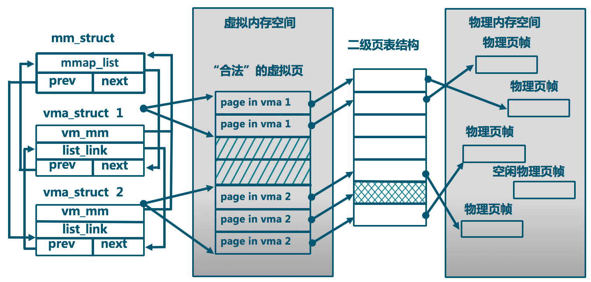
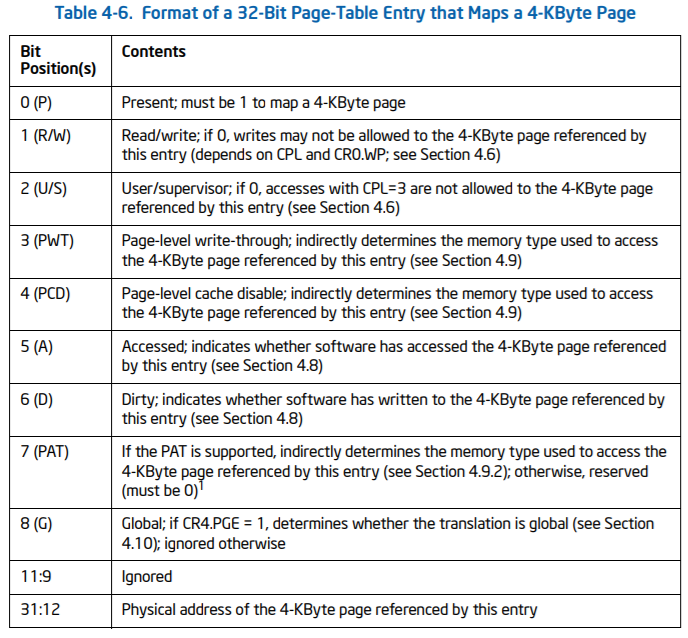

# Ucore-Lab 3

## Analysis of Some Source Code

Lab3实现了用户进程需要用到的虚拟内存空间管理的相关结构和相关函数，给Lab4和Lab5做了铺垫。

虚拟内存空间管理中最上层的数据结构是下面Code Block中的`struct mm_struct`，它用于管理用户级进程中的虚拟地址空间。这个结构中通过一个`struct vma_struct`的链表维护了进程虚拟地址空间中的合法的线性地址区间的集合。二者的关系如下图所示。

```c
// the control struct for a set of vma using the same PDT
struct mm_struct {
    list_entry_t mmap_list;        // linear list link which sorted by start addr of vma
    struct vma_struct *mmap_cache; // current accessed vma, used for speed purpose
    pde_t *pgdir;                  // the PDT of these vma
    int map_count;                 // the count of these vma
    void *sm_priv;                 // record the pra_list in FIFO PRA
};

// the virtual continuous memory area(vma), [vm_start, vm_end), 
// addr belong to a vma means  vma.vm_start<= addr <vma.vm_end 
struct vma_struct {
    struct mm_struct *vm_mm; // the set of vma using the same PDT 
    uintptr_t vm_start;      // start addr of vma      
    uintptr_t vm_end;        // end addr of vma, not include the vm_end itself
    uint32_t vm_flags;       // flags of vma
    list_entry_t list_link;  // linear list link which sorted by start addr of vma
};
```



当在用户级进程中申请新的内存区域时，实际上只建立了相应的`vma_struct`，而并没有实际分配具体的物理页框。物理页框是当用户进程访问了已经申请的合法虚拟地址区间中的地址（由`vma_struct`记录）时，此时因为该地址对应PTE中的`Present Bit = 0`，触发CPU的缺页中断，此时在中断处理进程中以中断栈帧、`cr2`寄存器中引起中断的线性地址作为参数，调用`do_pgfault`，在其中完成对于引发缺页中断的3种情况的处理：

- 目标页帧不存在（页表项全为0，即该线性地址与物理地址尚未建立映射或者已经撤销)。
- 相应的物理页帧不在内存中（页表项非空，但Present标志位=0，比如在swap分区或磁盘文件上)，这在本次实验中会出现，我们将在下面介绍换页机制实现时进一步讲解如何处理。
- 不满足访问权限(此时页表项P标志=1，但低权限的程序试图访问高权限的地址空间，或者有程序试图写只读页面)。

另外，换出的时机是在例如`kmalloc`分配内核内存空间，但内存空间不足的时候，这时候就会主动换出页面。为了支持swap in时候能查找到原本所述的虚拟页，`struct Page`中添加了`pra_vaddr`；为了决定换出的次序，添加了`pra_page_link`。

```c
struct Page {  
……   
list_entry_t pra_page_link;   
uintptr_t pra_vaddr;   
};
```

因为通过`do_pgfault`分配的页框是属于用户态进程的，所以对这些页框的清理工作也是在用户进程退出的时候进行的，这不属于Lab3的范围，就说怎么找了半天怎么清理页框没有找到。

## Exercise 0 - 填写已有实验

vim+diff大法好。

## Exercise 1 - 给未被映射的地址映射上物理页（需要编程）

### Description

完成`do_pgfault（mm/vmm.c）`函数，给未被映射的地址映射上物理页。设置访问权限 的时候需要参考页面所在 VMA 的权限，同时需要注意映射物理页时需要操作内存控制 结构所指定的页表，而不是内核的页表。注意：在LAB3 EXERCISE 1处填写代码。执行

```bash
make qemu
```

后，如果通过check_pgfault函数的测试后，会有“check_pgfault() succeeded!”的输出，表示练习1基本正确。

请在实验报告中简要说明你的设计实现过程。

### Solution

#### `do_pgfault`

```c
int
do_pgfault(struct mm_struct *mm, uint32_t error_code, uintptr_t addr) {
    ....
    ....
    
    ptep = get_pte(mm->pgdir, addr, 1);
    if (*ptep == 0) {
        if (pgdir_alloc_page(mm->pgdir, addr, perm) == NULL) {
            cprintf("pgdir_alloc_page FAILED!\n");
            goto failed;
        }
    }
    else {
        if (swap_init_ok) {
            struct Page *page = 0;

            ret = swap_in(mm, addr, &page);
            if (ret) {
                cprintf("swap_in FAILED!\n");
            }

            page_insert(mm->pgdir, page, addr, perm);
            swap_map_swappable(mm, addr, page, 1);

            // `addr` has been ROUNDED DOWN by PGSIZE
            page->pra_vaddr = addr;
        }
    }

    ret = 0;
failed:
    return ret;
}
```

这个参照着提示写就好了，主要是先了解不同数据结构的意义。

#### 思考题

##### 请描述页目录项（Page Directory Entry）和页表项（Page Table Entry）中组成部分对ucore实现页替换算法的潜在用处。



可以看到其中有一些位如`Dirty`、`Acessed`就是实现Clock PRA或Enhanced Clock PRA所必须的。

##### 如果ucore的缺页服务例程在执行过程中访问内存，出现了页访问异常，请问硬件要做哪些事情？

首先CPU会产生一个中断，把引起Page Fault的Linear Address装到CR2寄存器中，将`CS`、`EIP`、`EFLAGS`、`Error Code`等压入内核栈，并根据TSS中的信息切换`SS`和`ESP`，根据IDT跳转到对应的ISR，在Ucore中，最终是跳转到`kern/trap/trap.c`中的`trap_dispatch`这个函数。

然后在`trap_dispatch`这个函数中，switch到`T_PGFLT = 14`这个值，在这里面处理Page Fault相关的处理操作。

这不是Lab2中已经问过了嘛。。

## Exercise 2 - 补充完成基于FIFO的页面替换算法（需要编程）

### Description

完成`vmm.c`中的`do_pgfault`函数，并且在实现FIFO算法的`swap_fifo.c`中完成`map_swappable`和`swap_out_victim`函数。通过对swap的测试。注意：在LAB3 EXERCISE 2处填写代码。执行

```bash
make　qemu
```

后，如果通过`check_swap`函数的测试后，会有“check_swap() succeeded!”的输出，表示练习2基本正确。

请在实验报告中简要说明你的设计实现过程。

### Solution

#### `map_swappable`

```c
static int
_fifo_map_swappable(struct mm_struct *mm, uintptr_t addr, struct Page *page, int swap_in)
{
    list_entry_t *head=(list_entry_t*) mm->sm_priv;
    list_entry_t *entry=&(page->pra_page_link);

    assert(entry != NULL && head != NULL);
    //record the page access situlation
    /*LAB3 EXERCISE 2: YOUR CODE*/
    //(1)link the most recent arrival page at the back of the pra_list_head qeueue.

    list_add(head, entry);
    return 0;
}
```

#### `_fifo_swap_out_victim`

```c
static int
_fifo_swap_out_victim(struct mm_struct *mm, struct Page ** ptr_page, int in_tick)
{
    list_entry_t *head=(list_entry_t*) mm->sm_priv;
    assert(head != NULL);
    assert(in_tick==0);
    /* Select the victim */
    /*LAB3 EXERCISE 2: YOUR CODE*/
    //(1)  unlink the  earliest arrival page in front of pra_list_head qeueue
    //(2)  assign the value of *ptr_page to the addr of this page

    list_entry_t *le = head->prev;

    struct Page* page_to_del = le2page(le, pra_page_link);
    list_del(le);

    // `*ptr_page` should be `page_to_del`
    // and be passed out of the function.
    *ptr_page = page_to_del;

    return 0;
}
```

这两个实验也不难，主要参照注释写。

#### 思考题

##### 如果要在ucore上实现"extended clock页替换算法"请给你的设计方案，现有的swap_manager框架是否足以支持在ucore中实现此算法？如果是，请给你的设计方案。如果不是，请给出你的新的扩展和基此扩展的设计方案。

当然已经足够支持。

##### 如果支持，回答如下问题

###### 需要被换出的页的特征是什么？

以Enhanced Clock算法为例，按照如下规则选择被换出的页，记（Access Bit, Dirty bit），则：

- （0，0）表示最近未被引用也未被修改，首先选择此页淘汰；
- （0，1）最近未被使用，但被修改，其次选择；
- （1，0）最近使用而未修改，再次选择；
- （1，1）最近使用且修改，最后选择。

###### 在ucore中如何判断具有这样特征的页？

```c
!(*ptep & PTE_A) && !(*ptep & PTE_D)  //没被访问过 也没被修改过
 (*ptep & PTE_A) && !(*ptep & PTE_D)  //被访问过 但没被修改过
!(*ptep & PTE_A) && (*ptep & PTE_D)   //没被访问过 但被修改过
!(*ptep & PTE_A) && !(*ptep & PTE_D)  //被访问过 且被修改过
```

###### 何时进行换入和换出操作？

这个在上文中已经说明过了。

## Challenge 1 - 实现识别dirty bit的 extended clock页替换算法

咕咕咕。TODO

## Challenge 2 实现不考虑实现开销和效率的LRU页替换算法

咕咕咕。TODO